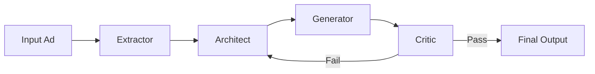

# Hyper-Personalized DA Auto-Generation Agent

## Abstract

본 프로젝트는 사용자가 상호작용한 광고 이미지로부터 **Style DNA**를 추출하고, 이를 브랜드 가이드라인 및 신규 제품 정보와 결합하여 새로운 광고 이미지를 자동 생성하는 멀티 에이전트 기반 파이프라인을 제안한다.  

시스템은 추출(Extraction), 설계(Architecture Design), 생성(Generation), 검증(Validation)의 네 단계로 구성되며, 검증 단계에서 기준 미달 시 설계 단계로 회귀하는 **Feedback Loop 구조**를 포함한다. 이를 통해 스타일 일관성과 브랜드 적합성을 동시에 만족하는 자동화된 광고 생성 프로세스를 구현한다.

---

## 1. System Overview

본 시스템은 다음의 순차적 구조를 따른다:

**Input Advertisement → Style Extraction → Blueprint Design → Image Synthesis → Guideline Verification**

검증 실패 시 설계 단계로 회귀하여 재생성 과정을 수행한다.



---

## 2. Methodology

### 2.1 Stage I — Extractor (Style DNA Extraction)

시각 및 텍스트 특성 분석을 병렬적으로 수행하기 위해 세 개의 독립 모듈로 분리하였다.

- **Image Style Agent**
  - 조명 특성 분석
  - 색상 분포 및 팔레트 추출
  - 전반적 무드 및 질감 파악

- **Layout Style Agent**
  - 시각적 계층 구조 분석
  - 제품 및 텍스트 배치 구조 추론
  - 시선 흐름 모델링

- **Copy Style Agent**
  - 문체 및 어조 분석
  - 평균 문장 길이 및 강조 방식 추출
  - 설득 구조 패턴 분석

이 단계의 출력은 구조화된 **Style DNA Representation**이다.

---

### 2.2 Stage II — Architect (Blueprint Construction)

Extractor 단계에서 도출된 Style DNA를 신규 제품 정보 및 브랜드 가이드라인과 결합하여 생성 설계도를 구성한다.

주요 구성 요소는 다음과 같다:

- **Prompt Engineering**
  - FLUX.1 입력을 위한 구조화된 영문 프롬프트 생성
  - 스타일 제약 조건 및 부정 프롬프트 포함

- **Layout Mapping**
  - 텍스트 및 제품 객체의 좌표 및 영역 정의
  - 상대적 비율 및 여백 규칙 명시

- **Copy Generation**
  - 스타일 기반 헤드라인 생성
  - 브랜드 가이드라인을 준수하는 광고 카피 작성

이 단계의 결과물은 Generator 단계에 전달되는 **Blueprint Specification**이다.

---

### 2.3 Stage III — Generator (Image Synthesis)

설계도에 기반하여 광고 이미지를 합성한다.

- **Base Generation**
  - FLUX.1 [dev] 모델을 사용한 배경 및 오브젝트 생성

- **Structural Consistency Control**
  - ControlNet 또는 IP-Adapter를 통한 형태 및 레이아웃 유지

- **Post-processing**
  - Pillow 기반 텍스트 및 로고 오버레이
  - 최종 해상도 및 포맷 정규화

---

### 2.4 Stage IV — Critic (Guideline Verification & Feedback Loop)

생성된 결과물이 브랜드 및 매체 가이드라인을 충족하는지 평가한다.

- 텍스트 가독성 검사
- 로고 위치 및 크기 검증
- 금지 요소 포함 여부 확인
- 레이아웃 규칙 준수 여부 평가

기준을 충족하지 못할 경우, 위반 사유를 구조화하여 Architect 단계로 전달하고 재설계를 수행한다.

---

## 3. Implementation Structure

본 프로젝트는 `uv` 기반 의존성 관리 시스템을 사용하며, 에이전트 중심 모듈 구조를 따른다.

```
.
├── src/
│   └── da_agent/
│       ├── agents/
│       │   ├── extractor/
│       │   │   ├── image_agent.py
│       │   │   ├── layout_agent.py
│       │   │   └── copy_agent.py
│       │   ├── architect.py
│       │   ├── generator.py
│       │   └── critic.py
│       ├── main.py
│       └── config.py
├── .env.example
├── pyproject.toml
└── README.md
```

---

## 4. Configuration

`.env.example` 파일을 복사하여 `.env` 파일을 생성하고 다음 API 키를 설정해야 한다.

```bash
OPENAI_API_KEY=your_openai_api_key_here
FAL_KEY=your_fal_ai_api_key_here
```

---

## 5. Roadmap

- [x] Vision 기반 스타일 추출 모듈 구현
- [x] uv 기반 패키지 관리 도입
- [ ] 멀티모달 기반 가이드라인 검증 로직 고도화
- [ ] Feedback Loop 최적화 및 토큰 비용 감소 전략 적용

---

## 6. License

MIT License  
Copyright (c) 2026
